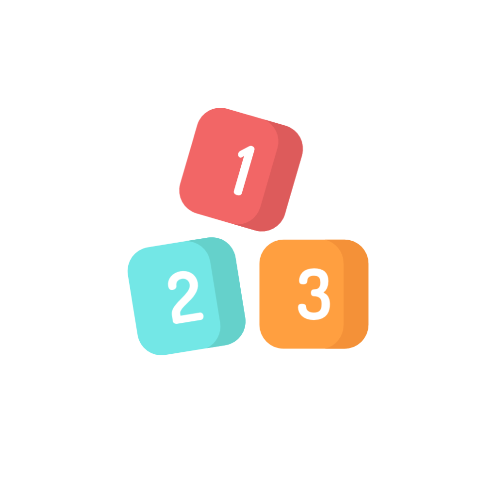

:construction: Projeto em desenvolvimento  :construction:
<h1 align="center">
  Projeto Crianca
  

  Lorem ipsum libero euismod conubia metus
</h1>

  
  
  
  

# 🧾 》Introducao
Esse projeto tem como intenção auxiliar as famílias de crianças/adolescentes autistas a melhorar a comunicação (não verbal) através de atividades pedagógicas adaptadas para as crianças. 

# 🧰 》Tecnologias usadas
Lorem ipsum libero euismod conubia metus sollicitudin viverra ligula erat, ante ac vivamus suspendisse tortor eros metus placerat, proin feugiat facilisis gravida diam tellus curabitur felis. 
- pharetra maecenas 
- bibendum mauris 
- sollicitudin quisque 
- suscipit

# 🤝🏼 》Parcerias
Lorem ipsum libero euismod conubia metus sollicitudin viverra ligula erat, ante ac vivamus suspendisse tortor eros metus placerat, proin feugiat facilisis gravida diam tellus curabitur felis. 
- pharetra maecenas 
- bibendum mauris 
- sollicitudin quisque 
- suscipit

# 📷 》Imagens do projeto
Lorem ipsum libero euismod conubia metus sollicitudin viverra ligula erat

 
  
  

# 📈 》Continuous Deployment com Netlify

https://projetocrianca.netlify.app/

